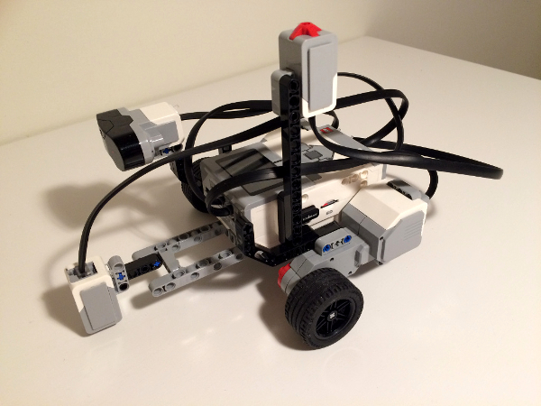
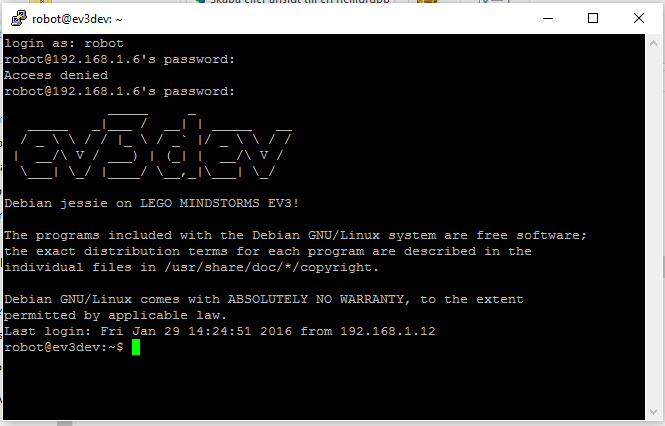
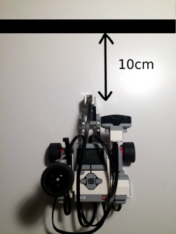

# Build a PID Controlled Line Following robot Using Lego Mindstorms, ev3dev, Pythonista and Python

## Background and Project Overview
This year i bought a Lego Mindstorms [Lego Mindstorms](http://www.lego.com/en-us/mindstorms/?domainredir=mindstorms.lego.com&ignorereferer=true) set for my kids and myself for Christmas. My kids are still mainly focused on "pimping" our robots but I started to wonder if there was an alternative to the provided “Lab View'ish” environment and I found the cool [ev3dev](http://www.ev3dev.org/) project on the web. I decided to try to see if I was able to recreate the [PID](https://en.wikipedia.org/wiki/PID_controller) controlled line follower robot found in the _The Art of Lego Mindstorms EV3 Programming_ book by _Terry Griffin_. I am obviously no programmer so it was a fun challenge for me and I will try to explain the necessary steps below.

## Build the robot
The first thing you need to do is to build a simple robot according to the picture. Exact details are not important as long as the following points are fullfilled.
* The robot should have two front wheels, each connected to a large motor.
* One swivel wheel in the back.
* Color sensor mounted 5-10cm in front of the robot and 5-10mm above the floor.  



## Install ev3dev on a MicroSD card
You don't need to flash any firmware or so. [ev3dev](http://www.ev3dev.org/) (which is like Debian Linux for EV3) installs on a MicroSD card and when it's inserted in the brick it boots from there instead of from the regular Mindstorms OS. The whole process is documented on the [ev3dev](http://www.ev3dev.org/) homepage. Python 2 and 3 are already installed in the [ev3dev](http://www.ev3dev.org/) environment.

## Transfer files to the brick
There are several ways to transfer files to the brick under [ev3dev](http://www.ev3dev.org/). USB (not tested), Bluetooth and WiFi. Bluetooth support are included in the brick but unfortunately it has no WiFi adapter built in. The support for USB WiFi adapters is also poor by default (I don't know if [ev3dev](http://www.ev3dev.org/) has better support) but I managed to find an [Edimax N150 WiFi Nano USB Adapter](http://www.webhallen.com/se-sv/datorer_och_tillbehor/181753-edimax_150mbps_wireless_nano_usb_adapter&atcl=search:live) at [Webhallen](http://www.webhallen.com/) here in Sweden that seem to work fine. Both WiFi and Bluetooth requires a little fiddling but most of the info was on the [ev3dev](http://www.ev3dev.org/) homepage or could be figured out anyway. I decided to focus on the WiFi way.

### From IOS using Pythonista and StaSh
I love the [Pythonista]([Pythonista](http://omz-software.com/pythonista/) project and it's dedicated [community](https://forum.omz-software.com/) and decided to start here, if I needed help they would probably provide the quickest and best support. I installed [StaSh](https://github.com/ywangd/stash) and with some help from from the [community](https://forum.omz-software.com/) especially from [Ywangd](https://github.com/ywangd) and [Dgelessus](https://github.com/dgelessus) I managed to figure out how to send files from [Pythonista]([Pythonista](http://omz-software.com/pythonista/) and [StaSh](https://github.com/ywangd/stash) using scp. I launched [StaSh](https://github.com/ywangd/stash) and cd'ed to my program folder and entered `scp -p maker file_name.py robot@192.168.1.6:/home/robot/` (ofcourse replace my ip with your ip) after a few seconds the file was transferred. Default user name is _robot_ and password is _maker_ in the [ev3dev](http://www.ev3dev.org/) environment.

### From Windows using WinSCP
The interface is self explanatory. [WinSCP](https://winscp.net/eng/index.php) can also be used to change read/write/execute rights if necessary.  

## Execute commands
It's possible to execute programs from the brick but if I use ssh I can debug using print statements in the programs and see the result on the ipad/PC screen.

### From IOS using Pythonista and StaSh
I was able to execute commands on the brick using [StaSh](https://github.com/ywangd/stash) and ssh. The command I used to login to my brick was `ssh –password maker robot@192.168.1.6` and then `python file_name.py` at the prompt to execute the program.
Picture.

### From Windows using Putty
The interface is self explanatory. Enter IP address and username “robot” and password “maker” when prompted.  



## Line Follower program
Ok. We now have almost everything we need.  
* We have a robot.
* We have ev3dev installed on a MicroSD card.
* The lego brick boots in to the new environment.
* We are able to transfer files to the brick
* We are able to execute files on the brick.  

All we need to do now is to write the programs

### max_min_finder.py
The first thing we need to do is to detect max and min sensor readings in our environment (a calibration to be able to set our target). Place the robot approximatly 10cm from the line (perpendicular) and run the program. Make sure it passes the line.  



#### Program Description
- Import modules
```python
from time   import time, sleep
from ev3dev.auto import *
```
- Connect motors to B and C and color sensor to, for example, 1 on the brick. Change color sensor mode.
```python
left_motor = LargeMotor(OUTPUT_B);  assert left_motor.connected
right_motor = LargeMotor(OUTPUT_C); assert right_motor.connected
col= ColorSensor();                 assert col.connected
col.mode = 'COL-REFLECT'
```
- Run function. Run both motors at 30% power for 5 seconds and measure color sensor reflective value. Print Max and Min.
```python
def run():
  left_motor.run_direct(duty_cycle_sp=30)
  right_motor.run_direct(duty_cycle_sp=30)
  max_ref = 0
  min_ref = 100
  end_time = time() + 5
  while time() < end_time:
    read = col.value()
    if max_ref < read:
      max_ref = read
    if min_ref > read:
      min_ref = read
  left_motor.stop()
  right_motor.stop()
  print 'Max: ' + str(max_ref)
  print 'Min: ' + str(min_ref)
  sleep(1)
```

### Line follower
I have made two slightly diffrent programs. `Line_follow.py` and `Line_follow_2.py`. `Line_follow.py` use a more aggressive steering algorithm that adjusts the power on each motor from -100% (full reverse) to 100% (full forward) approximatly 100Hz (in theory). `Line_follow_2.py` use a less aggressive algorithm that adjusts the power on each motor from 0-100% (never reverse). The first program might be tougher on the motors but more exact. The second program is less tough on the motor (I imagine...) and less exact when it comes to "line-details". To make your robot work as good as possible you need to tune the controller ie. set the appropriate gain parameters.

#### Program Description
The majority of the programs are the same.
- Import modules.

```python
from time   import time, sleep
from ev3dev.auto import *
```
* Input area.

  * power. Maximum power on any of the motors in percent.
  * minRef. Reflecting light from the darker line (from the `max_min_finder.py` program above).
  * maxRef. Reflecting light from the lighter floor (from the `max_min_finder.py` program above).
  * target. It's easier to follow the edge between the line and the floor than the line it self. Our goal is therefore be in the area close to a reflecting light reading of ~70. To get an even more robust model it's better to not stay to close to the line and reduce the risk for the robot to cross the line and "wander away". If the robot crosses the line chances are small that it will recover. Target is a normalized value to work with any `maxRef` or `minRef`.
  * Finding the appropriate gain parameters can be difficult. You can start with kp=1 and kd=ki=0. Progressively reduce Kp by 0.05 until the robot follows a staight line with no or litte side to side movement. Progressively increase Ki by 0.01 until the robot follows the edge of a straight line with no oscillation. Test with a curved line and increase kd by 1 untill it can follow the entire path. Increase power and test again.
  * kp. Proportional gain. 
  * kd. Derivative gain.
  * ki. Integral gain.
  * direction. 1 or -1. Use -1 if you place the robot on the left side of a darker (than floor) line or on the right side of a lighter (than floor) line. Use 1 if you place the robot on the left side of a lighter (than floor) line or on the right side of a darker (than floor) line.
  
```python
power = 50
minRef = 40
maxRef = 100
target = 55
kp = float(0.65)
kd = 1
ki = float(0.02)
direction = -1
```
- Connect hardware. Connect two large motors at output "B" and "C" and TouchSensor and ColorSensor at input "1" and "2" (auto identified) on the brick. Change color sensor mode to measure reflecting light. Add a "button" so we can break the program using one of the buttons on the brick.
```python
left_motor = LargeMotor(OUTPUT_B);  assert left_motor.connected
right_motor = LargeMotor(OUTPUT_C); assert right_motor.connected
ts = TouchSensor();    	assert ts.connected 
col= ColorSensor(); 	assert col.connected
col.mode = 'COL-REFLECT'
btn = Button()
```
- Steering module alt. 1: "aggressive". A more aggressive steering algorithm that adjusts the power on each motor from -100% (full reverse) to 100% (full forward) approximatly 100Hz (in theory).
```python
def steering(course, power):
	power_left = power_right = power
	s = (50 - abs(float(course))) / 50
	if course >= 0:
		power_right *= s
		if course > 100:
			power_right = - power
	else:
		power_left *= s
		if course < -100:
			power_left = - power
	return (int(power_left), int(power_right))
```
- Steering module alt. 2: "less aggressive". A less aggressive algorithm that adjusts the power on each motor from 0-100% (never reverse).
```python
def steering2(course, power):
	if course >= 0:
		if course > 100:
			power_right = 0
			power_left = power
		else:	
			power_left = power
			power_right = power - ((power * course) / 100)
	else:
		if course < -100:
			power_left = 0
			power_right = power
		else:
			power_right = power
			power_left = power + ((power * course) / 100)
	return (int(power_left), int(power_right))
```
- Run module with the [PID](https://en.wikipedia.org/wiki/PID_controller) algorithm.
```python
def run(power, target, kp, kd, ki, direction, minRef, maxRef):
	lastError = error = integral = 0
	left_motor.run_direct()
	right_motor.run_direct()
	while not btn.any() :
		if ts.value():
			print 'Breaking loop' # User pressed touch sensor
			break
		refRead = col.value()
		error = target - (100 * ( refRead - minRef ) / ( maxRef - minRef ))
		derivative = error - lastError
		lastError = error
		integral = float(0.5) * integral + error
		course = (kp * error + kd * derivative +ki * integral) * direction
		for (motor, pow) in zip((left_motor, right_motor), steering2(course, power)):
			motor.duty_cycle_sp = pow
		sleep(0.01) # Aprox 100Hz
```
- Execute program and stop motors before exit.
```python
run(power, target, kp, kd, ki, direction, minRef, maxRef)
print 'Stopping motors'
left_motor.stop()
right_motor.stop()
```
## YouTube videos (no sound)
[Less Aggressive Steering](https://youtu.be/EEaR4wTu0Tc)  
[Aggressive Steering](https://youtu.be/NZ4VghO60Sc)
